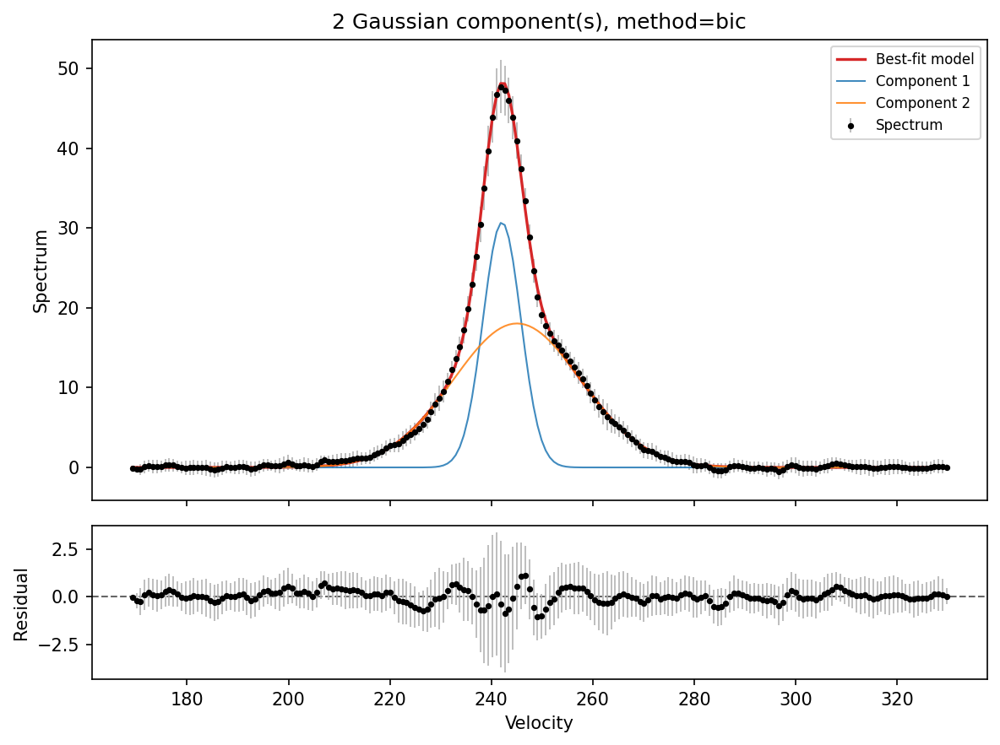

Examples
========

The repository includes an example spectrum at:

.. code-block:: text

   examples/example_spectra.txt

Run the example script from the project root:

.. code-block:: bash

   python examples/run_example.py

The script writes:

.. code-block:: text

   examples/example_components.csv
   examples/example_fit.png

The example output plot is shown below as a reference for a successful fit:

The fitted component table is also included as a downloadable example output:

:download:`Download example_components.csv <../examples/example_components.csv>`
